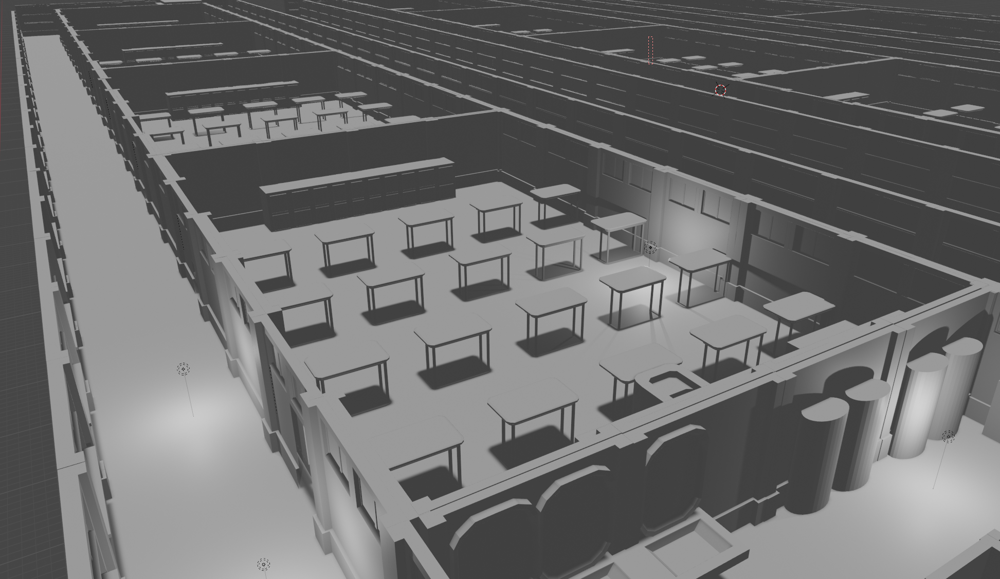

# 프로젝트명: 악몽(NIGHTMARE)

# [컨셉]

## 메인컨셉 :공포

- 직접적인 무언가를 보는것으로 느끼는 공포가아닌, 좁은공간의 폐쇄성과 불안감등 미지에서 부터 오는 본질적인 공포

### 서브 컨셉 1 :시선

- 불특정 다수의 시선으로부터 느껴지는 불쾌함을 시각적으로 표현

### 서브 컨셉 2 :폐쇠

- 좁은공간 혹은 모르는공간 오는 불안감의 증대를위해 시야를 좁게처리한다.

### 서브 컨셉 3 :경험

- 타인의 꿈을 체험함으로써 지금까지의 삶과는 다른 이야기를 경험시켜준다.

### 서브 컨셉 4 :미지

- 현실에서는 갈수없는곳, 알수없는물체, 생명체등을 등장시켜 플레이어들이 이를 무엇인지 고민하게하고 이로부터 공포를 느낄수있게끔 조장한다.

### 서브 컨셉 5 :안정

- 특정 주기마다 안전한곳에 다다르게 하여 게임플레이로 인하여 생기는 스트레스를 완화시켜준다.

  

# [관련 이미지 & 동영상]

- 이미지  
  
  
- 동영상
- 
  

  

# [대표 이미지]

  

# [컨셉 & 대표이미지 기반 작품묘사]

> ### 대표이미지 기반 :

> ### 컨셉 기반:

  

# [<게임제목> 구성 요소]

- 악몽(NIGHTMARE)

 

## 1. 메커니즘

[도전 과제]

1. 에너미의 외견,꿈속세계의 표현의 극대화
2. 가나다라마바사아차카타파하

[재미 요소]

1. 각 장소마다 트릭을풀고 나아간다.
2. 에너미를 처치하고, 스토리의 비밀을 하나씩 푼다.
3. 기억의 파편등, 수집아이템의 수집.

 

## 2. 이야기

[배경스토리]  
21세기 한국은 남녀노소 관계없이 만인이 스트레스에 치어사는 나라가 되었다.
일련의 스트레스는 일부 사람들을 악몽에 시달리게 하는 지경에 다다랐고,
당국은 이를 해결하기위해 새로 개발된 뇌과학과 가상현실 기술의 접목으로,
환자의 악몽을 체험,개입해서 치료하는 프로젝트를 시작했다.
주인공A씨는 신경정신과 의사로써 프로젝트에 참가하게 된다..

[만들게 된 배경]  
살면서 직/간접적으로 경험한 이야기 혹은 게임을 바탕으로 하나의 게임으로 재구성 해보고자 하였음

[카메라 관점]  
주인공인 의사의 시점
 

## 3. 미적요소

[디자인][컬러]  
전체컬러: 

-현실:풀컬러 저채도

-악몽세계:모노톤

주인공:
의사가운착용,항시 담배를 물고있다./짙은 다크서클,항상 피곤해보이는 얼굴

배경:현실 교정을 모티브로 제작,제작자의 기억및 사진자료를 수집하여, 최대한 현실성 반영

악몽세계의 경우 꿈의 특성을 살려 건물의 엣지등을 흐릿하게 표현, 안개와 그림자등을 적절히 배치

또한, 학교~외부등 꿈속 내부공간은 최대한 현대적인건물을 배치하여 

도시스러움을 강조함과 동시에, 꿈임을 알수있는 안개등을 배치한다.

현실의 치료실은 최대한 깔끔한 연구실풍으로 꾸민다. 

가운데 환자용 침대가있고, 그 주위로 장치및 설비를 배치해놓는다. 

[음향]  
-연구소(치료실)에서는 최대한 안정적인 bgm을 배치, 꿈속에서는 긴박한상황이 아니면 사운드를 깔지않는다.

-효과음은 최대한 호러풍이지만 놀라지않을만한 잔잔한사운드로 선정한다.
 

## 4. 기술

블렌더3d를 이용하여 에셋외에 묘사에 필요한 부분을 직접제작

시간이 남는다면 vr적용

# [<악몽(NIGHTMARE)> 시스템디자인]
## . 1. 게임 오브젝트 분해 (구성 요소 분석)
### [학교]
#### [교실]
- 책상
- 교탁
- 의자
- 칠판
- 사물함
- 창문
- 미닫이문
- 모니터
#### [교무실]
- 교무실 책상
- 교무실 책장
- 개인pc
- 칸막이
- 자리 이름표
- 기타 소품(교편,노트,열쇠)
#### [화장실]
- 좌변기
- 소변기
- 세면대
- 청소도구(대걸레/밀대)
- 칸막이
#### [복도]
- 창문
- 
#### [옥상]
- 옥상 펜스
- 
### [자택]
### [연구실]

-
-
-
-
## . 2. 피라미터(속성)
-
-
-
-
-
## . 3. 행동
-
-
-
-
-
## . 4. 상태
-
-
-
-

## . 5. 속성

-
-
-
-
-
## . 5. 규칙

# [<악몽(NIGHTMARE)> 개발요구사항/흐름도]
## 1.요구사항
### [1주차(3주)]
#### 1.학교건물모델링(총4F 1~3F실내 4F:옥상)
- 교실프리셋1,교무실1,화장실1,출입구1
- 계단1
- 
- 옥상1
- 조립
##### <제작리스트>
- 학교벽 4패턴(복도/창문/화장실/화장실창문)
- 
- 
- 
- 칠판
- 
- 학교옥상바닥 - 에셋으로 대체
- 학교화장실바닥 - 에셋으로 대체
- 선반 3패턴 - 에셋으로 대체
##### <1~3층 내부총합>
- 
- 
- 교실내부
- 
- 추가적인 소품들은 에셋으로 대체후 추가
##### <1주 밀린작업>
- 유니티에 얹은후 콜라이더 추가
- 캐릭터작업

### [2주차(4주)]
- 플레이어 손(에셋)
- 후레쉬 이펙트(어두운곳 비추는)
- 발자국사운드
- 앉기
##### <제작리스트>
- 캐릭터모델
- 후레시모델
- 라이트이펙트
- 사운드(에셋)
- 앉기구현
- 
### [3주차(5주)]
- 에너미 모델링
- 에너미 배회 스크립트
- 에너미 캐릭터 인지
- 이동속도조정 [주인공 > 에너미]

## 2.스토리보드
- 1주차
- 2주차
- 3주차
- 
## 3.키보드 이벤트에 대한 흐름도

#[<악몽(NIGHTMARE)> 개발일정]
## 1주차
-전체적인 맵 동선 구성
-플레이어의 이동
-플레이어 임시모델 생성
-오브젝트 리스트 재정비
-스토리보드 드로윙
## 3주차
## 4주차
